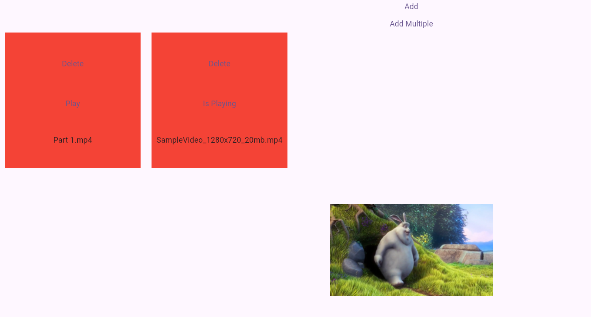

# web_video_pick_show

This package can be used to pick and view video in web.

## Warning:

Works only for Web, and uses html.File a lot.
On other platform throws compile time error if this package is used,
will be solved in next releases.

## To Pick:

```
   final _controller = WebVideoPickerController();
   
    await controller.pickVideo();
    
    //OR
    
    await controller.pickMultipleVideo();
    
    //Make sure to handle WebVideoPickShowException
     
    _controller.dispose();//On dispose of StatefulWidget to avoid memory leaks
     
```

## To show picked items for user to play one out of all:

```
ListenableBuilder(
  listenable: controller,
  builder: (context, _) {
    final data = controller.data;
     return ... //Render the items //See examples for better examples
    }
 );
 
```



As you can see in the image, two red box are the picked items. You can manage them by:

```
    controller.play(file);
    controller.remove(index);
    controller.add(file);
    controller.addMany([file1,file2]);
    controller.addRemoveManually((item)=>manage and return manually);
    controller.clear();
    controller.isVideoPlaying(fileWhichNeedToBeCheckedWhetherPlaying);
    
 
```

To check whether two files are equal I have added this extension on html.File:

```
   html.File file1;
   html.File file2;
   print("file1.uniqueValue()==file2.uniqueValue();
```

## Playing the video

```
  EasyWebVideoShowWidget(
     controller: _controller,
  ),
  
  //Or if you have picked without using my package, and the file is of html.File format
   
  CustomWebVideoShowWidget(
     uniqueKey: ValueKey(someUniqueValueToDifferentiateTwoFile),
     file: fileWhichMightBePickedFromSomeOtherSource,
  ),
 ```

## Error Handling

And sorry for the Oppsie! error if you catch WebVideoPickShowException.

```
 try {
     //Some action
    } on WebVideoPickShowException catch (e, s) {
      //Instead of e.toString() use:
      e.withoutOppsie();
      //Else your error message would be : "Oppsie! File not found!"
    } catch (e, s) {
      //Handle It
    }
 ```

Its intentional bug ;-) because it reminds of one of my friend :-)

## -------------------------------------------------------

For detailed example please view examples, either
from [Repository](https://github.com/AradhyaNepal/web_video_pick_show)

Also check for alternative way if you have old flutter
version [AlternativeWay](https://github.com/AradhyaNepal/web_video_pick_show/blob/main/example/lib/alternative_ways.dart)
Alternative way credit goes to : [CreditRepo](https://github.com/sawin0/video_player_web/)


